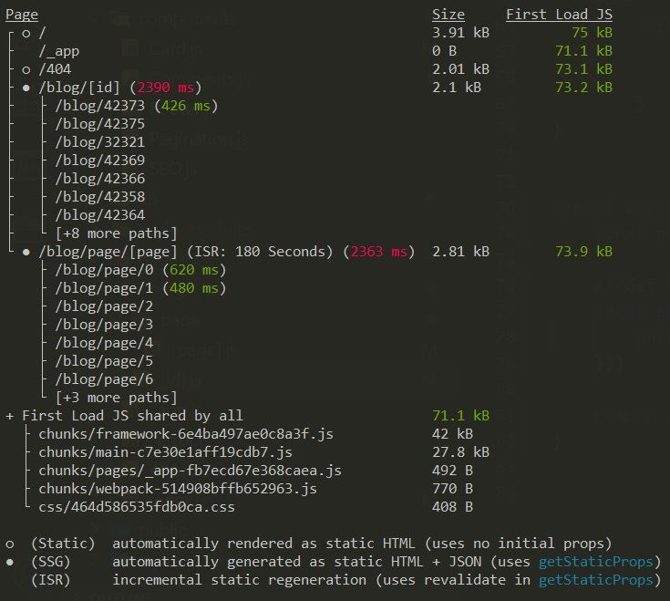

## Getting Started

First, install dependencies:

```bash
npm install
```
thin, run the development server:

```bash
npm run dev
```

Open [http://localhost:3000](http://localhost:3000) with your browser to see the result.


## Pages structure


